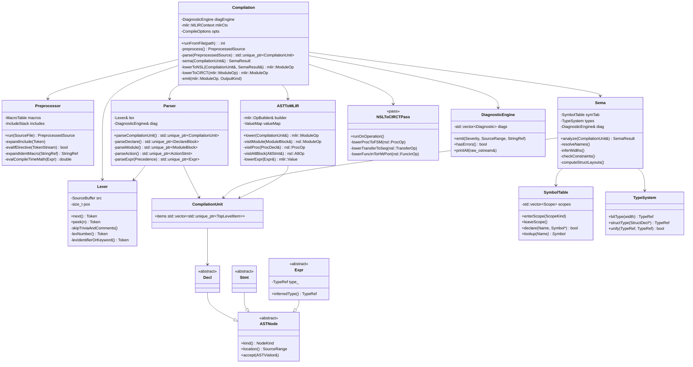
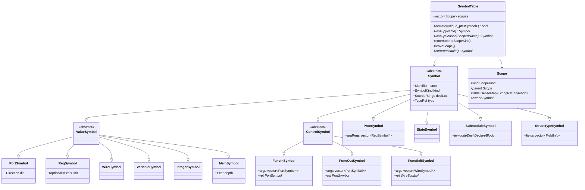

<!-- SPDX-License-Identifier: Apache-2.0 WITH LLVM-exception -->

# NSL → CIRCT/MLIR Compiler Design

A C++ compiler that translates NSL (Next Synthesis Language) source into Verilog HDL via the LLVM CIRCT infrastructure. This document describes the overall flow, layered architecture, data structures, and key class relationships.

---

## 1. Design Goals and Constraints

1. **Fidelity.** Preserve NSL semantics — especially the control-terminal (`func_in`/`func_out`/`func_self`), procedure (`proc`), and state-machine (`state`) abstractions — all the way down to the point where they are lowered to hardware primitives.
2. **Incremental lowering.** Follow MLIR's standard practice: start with a high-level dialect that mirrors NSL directly, then progressively lower through CIRCT's `fsm`, `hw`, `comb`, `seq` dialects, ending at a `hw`-only form that `ExportVerilog` can consume.
3. **Diagnostics-first.** Every IR node tracks an NSL source location; every error can be rendered back to the user's source file with line/column accuracy.
4. **Skill-based backend reuse.** The compiler owns the front-end (lexer, parser, AST, sema, NSL→MLIR lowering). Everything below the first MLIR form is stock CIRCT infrastructure — no hand-rolled netlist passes.
5. **Test-friendly pipeline.** Each stage can be driven independently from the command line (`nsl -emit=ast`, `-emit=mlir`, `-emit=hw`, `-emit=verilog`), and each output is deterministic.
6. **C++17.** Uses `std::variant`/`std::optional` throughout, RAII for all resources. C++20 features (concepts, ranges, `std::format`) are NOT used today; adoption would require an explicit Constitutional amendment per `.specify/memory/constitution.md` (Build, Code, and Licensing Standards).

---

## 2. Overall Pipeline

```
┌─────────────────┐
│   .nsl / .h     │   Source files (+ included headers)
└────────┬────────┘
         │
         ▼                              ┌─────────────────────────────────┐
┌─────────────────┐                     │                                 │
│   Preprocessor  │  handles            │  #define, #include (quote/      │
│                 │  directives,        │  angle form), #ifdef/#ifndef,   │
│                 │  %IDENT% subst,     │  #if <numeric>, compile-time    │
│                 │  compile-time math  │  _int/_pow/_sin/..., %NAME%     │
└────────┬────────┘                     │  identifier expansion           │
         │                              └─────────────────────────────────┘
         ▼
┌─────────────────┐
│     Lexer       │   token stream (keywords, identifiers, numbers,
│                 │    operators, system-task names, strings)
└────────┬────────┘
         │
         ▼
┌─────────────────┐
│     Parser      │   recursive descent driven by the final EBNF
│   (EBNF-guided) │
└────────┬────────┘
         │
         ▼
┌─────────────────┐
│      AST        │   concrete syntax tree; every node carries a
│                 │    SourceRange for diagnostics
└────────┬────────┘
         │
         ▼
┌─────────────────┐
│  Semantic       │   name resolution, type/width inference,
│  Analysis       │    S1–S29 constraint checking, struct layout
│  (Sema)         │
└────────┬────────┘
         │
         ▼
┌─────────────────┐
│  Typed AST +    │   AST annotated with resolved symbols,
│  Symbol Table   │    widths, and struct layouts
└────────┬────────┘
         │
         ▼
┌───────────────────────────────────────────────────────────────┐
│  NSL → MLIR Lowering (this is the project's own dialect)      │
│                                                                │
│   nsl::ModuleOp, nsl::ProcOp, nsl::FuncInOp, nsl::StateOp,    │
│   nsl::AltOp, nsl::AnyOp, nsl::SeqOp, nsl::TransferOp, ...    │
│                                                                │
└────────┬───────────────────────────────────────────────────────┘
         │
         ▼
┌───────────────────────────────────────────────────────────────┐
│  Structural Expansion Passes (NSL-dialect local)              │
│                                                                │
│   • generate-loop unroll (integer variables)                  │
│   • temporary variable (variable) expansion                   │
│   • struct-field SSA split                                    │
│   • multi-instance submodule array explode                    │
│   • %IDENT% post-resolution check (assert residue-free)       │
│                                                                │
└────────┬───────────────────────────────────────────────────────┘
         │
         ▼
┌───────────────────────────────────────────────────────────────┐
│  NSL → CIRCT Lowering                                          │
│                                                                │
│   nsl::ProcOp, nsl::StateOp          →  fsm::MachineOp        │
│   nsl::FuncInOp / FuncOutOp          →  hw port + 1-bit valid │
│   nsl::TransferOp (wire)             →  hw::WireOp + comb     │
│   nsl::TransferOp (reg)              →  seq::CompRegOp        │
│   nsl::AltOp / AnyOp / IfOp          →  comb::MuxOp chains    │
│   nsl::SeqOp (in func)               →  fsm::MachineOp        │
│   nsl::MemOp                         →  seq::FirMemOp         │
│   arithmetic / bitops                →  comb::*, hwarith::*   │
│                                                                │
└────────┬───────────────────────────────────────────────────────┘
         │
         ▼
┌─────────────────┐
│  fsm + hw +     │   CIRCT core dialects
│  comb + seq     │
└────────┬────────┘
         │
         ▼ (stock CIRCT passes)
┌─────────────────┐
│   fsm → hw      │   state-register materialization
└────────┬────────┘
         │
         ▼
┌─────────────────┐
│   hw + comb +   │   final shape consumable by ExportVerilog
│   seq + sv      │
└────────┬────────┘
         │
         ▼
┌─────────────────┐
│ ExportVerilog   │   CIRCT's sv-dialect → Verilog emitter
└────────┬────────┘
         │
         ▼
┌─────────────────┐
│   .v / .sv      │   synthesizable Verilog output
└─────────────────┘
```

---

## 3. Layered Architecture

The compiler is split into nine libraries, each a static C++ library with a single public header:

| Layer | Library | Public header | Depends on |
|---|---|---|---|
| 1 | `nsl-basic` | `nsl/Basic/SourceLocation.h`, `Diagnostic.h` | — |
| 2 | `nsl-preprocess` | `nsl/Preprocess/Preprocessor.h` | `nsl-basic` |
| 3 | `nsl-lex` | `nsl/Lex/Lexer.h`, `Token.h` | `nsl-basic` |
| 4 | `nsl-ast` | `nsl/AST/*.h` (one per node kind) | `nsl-basic` |
| 5 | `nsl-parse` | `nsl/Parse/Parser.h` | `nsl-lex`, `nsl-ast` |
| 6 | `nsl-sema` | `nsl/Sema/Sema.h`, `SymbolTable.h`, `TypeSystem.h` | `nsl-ast` |
| 7 | `nsl-dialect` | `nsl/Dialect/NSL/IR/*.h` (tablegen-generated) | MLIR, CIRCT |
| 8 | `nsl-lower` | `nsl/Lower/ASTToMLIR.h`, `NSLToCIRCT.h`, `Passes.h` | `nsl-sema`, `nsl-dialect`, CIRCT |
| 9 | `nsl-driver` | `nsl/Driver/Compilation.h`, `tools/nslc/main.cpp` | all of the above |

The driver's `main.cpp` is ~60 lines — it just parses CLI flags and calls the pipeline in `Compilation.h`.

---

## 4. Class Diagram (Overview)



---

## 5. AST Class Hierarchy

NSL's grammar yields a conventional AST with three parallel trees: declarations, statements, and expressions. The exception is NSL's statement-vs-expression form of `if` (parser note N1 in the grammar), which both trees can construct — we use separate node kinds and disambiguate at parse time based on context.

```mermaid
classDiagram
    class ASTNode {
        <<abstract>>
        +NodeKind kind
        +SourceRange loc
    }

    class Decl {
        <<abstract>>
        +Identifier name
    }
    class Stmt {
        <<abstract>>
    }
    class Expr {
        <<abstract>>
        +TypeRef type
    }

    Decl --|> ASTNode
    Stmt --|> ASTNode
    Expr --|> ASTNode

    class CompilationUnit {
        +items vector~TopLevelItem~
    }

    class StructDecl {
        +members vector~StructMember~
    }
    class DeclareBlock {
        +modifier optional~Modifier~
        +ports vector~PortDecl~
        +headerParams vector~HeaderParamDecl~
    }
    class ModuleBlock {
        +internals vector~InternalDecl~
        +actions vector~ActionStmt~
        +funcs vector~FuncDefn~
        +procs vector~ProcDefn~
    }
    class TopLevelParamDecl {
        +kind ParamKind
        +init Expr
    }

    StructDecl --|> Decl
    DeclareBlock --|> Decl
    ModuleBlock --|> Decl
    TopLevelParamDecl --|> Decl

    class PortDecl {
        +direction Dir
        +width WidthExpr
    }
    class RegDecl {
        +width optional~WidthExpr~
        +init optional~Expr~
    }
    class WireDecl {
        +width optional~WidthExpr~
    }
    class VariableDecl {
        +width optional~WidthExpr~
    }
    class IntegerDecl
    class MemDecl {
        +depth Expr
        +width Expr
        +init optional~InitList~
    }
    class FuncSelfDecl {
        +args vector~Identifier~
        +ret optional~Identifier~
    }
    class ProcNameDecl {
        +regArgs vector~Identifier~
    }
    class StateNameDecl {
        +names vector~Identifier~
    }
    class FirstStateDecl {
        +target Identifier
    }
    class SubmoduleDecl {
        +templateName Identifier
        +instances vector~Instance~
        +paramAssigns vector~ParamAssign~
    }
    class StructInstDecl {
        +typeName Identifier
        +kind RegOrWire
        +arraySize optional~Expr~
        +init optional~InitValue~
    }

    PortDecl --|> Decl
    RegDecl --|> Decl
    WireDecl --|> Decl
    VariableDecl --|> Decl
    IntegerDecl --|> Decl
    MemDecl --|> Decl
    FuncSelfDecl --|> Decl
    ProcNameDecl --|> Decl
    StateNameDecl --|> Decl
    FirstStateDecl --|> Decl
    SubmoduleDecl --|> Decl
    StructInstDecl --|> Decl

    class FuncDefn {
        +name ScopedName
        +body ActionStmt
    }
    class ProcDefn {
        +name Identifier
        +body ActionStmt
    }
    class StateDefn {
        +name Identifier
        +body ActionStmt
    }

    FuncDefn --|> Decl
    ProcDefn --|> Decl
    StateDefn --|> Decl
```

```mermaid
classDiagram
    class Stmt {
        <<abstract>>
    }

    class TransferStmt {
        +lhs Expr
        +op TransferOp
        +rhs Expr
    }
    class IncDecStmt {
        +target Expr
        +kind IncDec
        +prefix bool
    }
    class ControlCallStmt {
        +target ScopedExpr
        +args vector~Expr~
    }
    class BareFinishStmt
    class SystemTaskStmt {
        +name SystemTaskKind
        +args vector~Expr~
    }
    class ReturnStmt {
        +value optional~Expr~
    }
    class EmptyStmt
    class LabeledStmt {
        +label Identifier
    }
    class GotoStmt {
        +target Identifier
    }
    class InitBlockStmt {
        +items vector~InitItem~
    }
    class DelayTaskStmt {
        +count Expr
    }

    TransferStmt --|> Stmt
    IncDecStmt --|> Stmt
    ControlCallStmt --|> Stmt
    BareFinishStmt --|> Stmt
    SystemTaskStmt --|> Stmt
    ReturnStmt --|> Stmt
    EmptyStmt --|> Stmt
    LabeledStmt --|> Stmt
    GotoStmt --|> Stmt
    InitBlockStmt --|> Stmt
    DelayTaskStmt --|> Stmt

    class ParallelBlock {
        +items vector~BlockItem~
    }
    class AltBlock {
        +cases vector~CondCase~
        +elseCase optional~ActionStmt~
    }
    class AnyBlock {
        +cases vector~CondCase~
        +elseCase optional~ActionStmt~
    }
    class SeqBlock {
        +items vector~SeqItem~
    }
    class WhileBlock {
        +cond Expr
        +items vector~SeqItem~
    }
    class ForBlock {
        +form ForForm
        +items vector~SeqItem~
    }
    class IfStmt {
        +cond Expr
        +thenBr ActionStmt
        +elseBr optional~ActionStmt~
    }
    class StructuralGenerate {
        +init Identifier
        +cond Expr
        +step Expr
        +body ActionStmt
    }

    ParallelBlock --|> Stmt
    AltBlock --|> Stmt
    AnyBlock --|> Stmt
    SeqBlock --|> Stmt
    WhileBlock --|> Stmt
    ForBlock --|> Stmt
    IfStmt --|> Stmt
    StructuralGenerate --|> Stmt
```

```mermaid
classDiagram
    class Expr {
        <<abstract>>
        +TypeRef type
    }

    class LiteralExpr {
        +kind LiteralKind
        +value Value
    }
    class IdentifierExpr {
        +name ScopedName
        +resolvedSym Symbol~
    }
    class SystemVarExpr {
        +kind _random or _time
    }
    class UnaryExpr {
        +op UnaryOp
        +sub Expr
    }
    class BinaryExpr {
        +op BinaryOp
        +lhs Expr
        +rhs Expr
    }
    class ConditionalExpr {
        +cond Expr
        +thenE Expr
        +elseE Expr
    }
    class ConcatExpr {
        +parts vector~Expr~
    }
    class RepeatExpr {
        +count Expr
        +body Expr
    }
    class SignExtendExpr {
        +width Expr
        +sub Expr
    }
    class ZeroExtendExpr {
        +width Expr
        +sub Expr
    }
    class SliceExpr {
        +sub Expr
        +hi Expr
        +lo optional~Expr~
    }
    class FieldAccessExpr {
        +obj Expr
        +field Identifier
    }
    class CallExpr {
        +target ScopedExpr
        +args vector~Expr~
    }
    class StructCastExpr {
        +typeName Identifier
        +sub Expr
        +memberPath vector~Identifier~
    }
    class IncDecExpr {
        +target Expr
        +kind IncDec
        +prefix bool
    }

    LiteralExpr --|> Expr
    IdentifierExpr --|> Expr
    SystemVarExpr --|> Expr
    UnaryExpr --|> Expr
    BinaryExpr --|> Expr
    ConditionalExpr --|> Expr
    ConcatExpr --|> Expr
    RepeatExpr --|> Expr
    SignExtendExpr --|> Expr
    ZeroExtendExpr --|> Expr
    SliceExpr --|> Expr
    FieldAccessExpr --|> Expr
    CallExpr --|> Expr
    StructCastExpr --|> Expr
    IncDecExpr --|> Expr
```







### AST node skeleton (C++17)

```cpp
namespace nsl::ast {

enum class NodeKind : uint16_t {
    // Decls
    CompilationUnit, StructDecl, DeclareBlock, ModuleBlock, TopLevelParamDecl,
    PortDecl, RegDecl, WireDecl, VariableDecl, IntegerDecl, MemDecl,
    FuncSelfDecl, ProcNameDecl, StateNameDecl, FirstStateDecl,
    SubmoduleDecl, StructInstDecl,
    FuncDefn, ProcDefn, StateDefn,
    // Stmts
    TransferStmt, IncDecStmt, ControlCallStmt, BareFinishStmt,
    SystemTaskStmt, ReturnStmt, EmptyStmt, LabeledStmt, GotoStmt,
    InitBlockStmt, DelayTaskStmt,
    ParallelBlock, AltBlock, AnyBlock, SeqBlock, WhileBlock, ForBlock,
    IfStmt, StructuralGenerate,
    // Exprs
    LiteralExpr, IdentifierExpr, SystemVarExpr, UnaryExpr, BinaryExpr,
    ConditionalExpr, ConcatExpr, RepeatExpr, SignExtendExpr, ZeroExtendExpr,
    SliceExpr, FieldAccessExpr, CallExpr, StructCastExpr, IncDecExpr,
};

class ASTNode {
public:
    virtual ~ASTNode() = default;
    NodeKind kind() const noexcept { return kind_; }
    SourceRange loc() const noexcept { return loc_; }
    virtual void accept(ASTVisitor&) = 0;

protected:
    ASTNode(NodeKind k, SourceRange r) : kind_(k), loc_(r) {}
    NodeKind kind_;
    SourceRange loc_;
};

class Decl : public ASTNode { /* + name */ };
class Stmt : public ASTNode { /* no extra state */ };
class Expr : public ASTNode {
public:
    TypeRef inferredType() const { return type_; }
    void setInferredType(TypeRef t) { type_ = t; }
protected:
    TypeRef type_;  // filled by Sema
};

// One header per concrete node; uses final to enable devirtualization.
class TransferStmt final : public Stmt {
public:
    enum class Kind { WireEq, RegColonEq };
    TransferStmt(SourceRange r, Kind k,
                 std::unique_ptr<Expr> lhs, std::unique_ptr<Expr> rhs)
      : Stmt(NodeKind::TransferStmt, r),
        kind_(k), lhs_(std::move(lhs)), rhs_(std::move(rhs)) {}
    Kind kind() const noexcept { return kind_; }
    Expr& lhs() const noexcept { return *lhs_; }
    Expr& rhs() const noexcept { return *rhs_; }
    void accept(ASTVisitor& v) override { v.visit(*this); }
private:
    Kind kind_;
    std::unique_ptr<Expr> lhs_, rhs_;
};

}  // namespace nsl::ast
```

All AST nodes are owned via `std::unique_ptr` in a tree shape — no shared ownership, no cycles. Symbol references in `IdentifierExpr::resolvedSym` are non-owning raw pointers into the `SymbolTable` (which outlives the AST during sema).

---

## 6. Symbol Table and Type System



### Scope stack semantics

NSL has nested scopes that precisely mirror its syntactic nesting, which makes the symbol table's job straightforward:

| Scope | Opened by | Contains |
|---|---|---|
| Global | `CompilationUnit` | struct types, declare/module pairs, top-level params |
| Declare | `DeclareBlock` | header params, ports, control-input/output terminals |
| Module | `ModuleBlock` | internal terminals, regs, wires, procs, states, submodules |
| Proc | `ProcDefn` | per-proc `state_name`s, local reg/wire, `first_state` |
| Seq/Parallel | `{ … }` | declared inline via `internal_declaration` |
| Function | `FuncDefn` | `variable` locals, per-call registers |

Name resolution walks outward. A scoped reference like `SUB.port` is resolved by looking up `SUB` in the current scope, confirming it's a `SubmoduleSymbol`, and then looking up `port` in the template's declare scope.

### Type system

Types are immutable value objects interned in a `TypeSystem` so pointer equality implies type equality:

```cpp
namespace nsl::types {

enum class TypeKind { Bit, BitVector, Struct, Memory, Unresolved };

class Type {
public:
    TypeKind kind() const noexcept { return kind_; }
protected:
    TypeKind kind_;
};

class BitVectorType final : public Type {
public:
    uint64_t width() const noexcept { return width_; }
private:
    uint64_t width_;
};

class StructType final : public Type {
public:
    llvm::ArrayRef<FieldInfo> fields() const noexcept { return fields_; }
    uint64_t totalWidth() const noexcept { return totalWidth_; }
private:
    llvm::SmallVector<FieldInfo, 8> fields_;  // MSB → LSB order
    uint64_t totalWidth_;
};

class MemoryType final : public Type {
public:
    uint64_t depth() const noexcept { return depth_; }
    const Type* element() const noexcept { return element_; }
private:
    uint64_t depth_;
    const Type* element_;
};

using TypeRef = const Type*;

class TypeSystem {
public:
    TypeRef bit() { return &bitSingleton_; }
    TypeRef bitVector(uint64_t width);
    TypeRef structType(llvm::ArrayRef<FieldInfo>);
    TypeRef memory(uint64_t depth, TypeRef element);
    bool equal(TypeRef a, TypeRef b) const noexcept { return a == b; }
private:
    BitVectorType bitSingleton_{1};
    llvm::DenseMap<uint64_t, std::unique_ptr<BitVectorType>> bvCache_;
    // ... similar caches for struct/memory
};

}  // namespace nsl::types
```

Width inference is a single top-down pass that propagates widths from transfer destinations back to source expressions, using the rules in Ref §0's "Estimation of bit width in operation." Integer-typed sub-expressions are resolved at this point; structural-expansion integers are evaluated by the separate unrolling pass.

---

## 7. The `nsl` MLIR Dialect

We introduce a dedicated MLIR dialect called `nsl` that represents NSL at a level close to the source. This is the intermediate representation between the AST and CIRCT. Its job is to stay in NSL's abstractions (procedures, states, alt/any/seq blocks) long enough that the structural-expansion passes can unroll generate-loops and resolve compile-time integer variables, before lowering to CIRCT. Everything below that is stock CIRCT.

### Operation summary

```
# Module-level
nsl.module @Name { ... }             # container for a module; inputs/outputs as ports
nsl.struct @Name { field types }     # structural type declaration
nsl.submodule @Inst : @Template
nsl.connect %sub.port, %sig          # structural wiring

# Terminal / register / memory
nsl.reg "name" : !nsl.bits<4> = 0    # carries init attribute
nsl.wire "name" : !nsl.bits<8>
nsl.variable "name" : !nsl.bits<8>
nsl.mem "name" [256 x i8]

# Control terminals  (each parameterized by dummy args + optional return)
nsl.func_in "do"(%a, %b) : !nsl.bits<8>
nsl.func_out "done"(%r)
nsl.func_self "fire"(%w)

# Action blocks
nsl.alt { nsl.case %cond1 { ... } ... nsl.default { ... } }
nsl.any { nsl.case %cond1 { ... } ... nsl.default { ... } }
nsl.if %cond { ... } else { ... }
nsl.parallel { ... }
nsl.seq { ... }
nsl.while %cond { ... }
nsl.for %init, %cond, %step { ... }

# Atomic actions
nsl.transfer %dst, %src          : !nsl.bits<N>       # wire-style =
nsl.clocked_transfer %reg, %src  : !nsl.bits<N>       # reg-style :=
nsl.incdec %reg { kind = pre_inc, ... }
nsl.call @target(%a, %b)
nsl.finish                                             # bare finish
nsl.finish_method @procInst                            # <inst>.finish()
nsl.invoke_method @procInst(%a)                        # <inst>.invoke(...)

# Procedure / state / function
nsl.proc @name(%arg: !nsl.bits<N>) { ... }
nsl.first_state @stName                                # inside a proc
nsl.state @stName { ... nsl.goto @other ... }
nsl.func @scopedName { ... }

# System tasks
nsl.sim_display "fmt", %args
nsl.sim_finish "fmt", %args
nsl.sim_init { ... nsl.sim_delay 10 ... }
```

### Why a dedicated dialect

Keeping NSL's abstractions (procedures, states, alt/any/seq blocks) alive in MLIR through at least one round of transformation pays off in three ways:

1. **Structural expansion is simpler at the NSL level.** `generate` loops, integer variables, and `variable` partial assignments are expanded by a pass that walks `nsl.for`/`nsl.structural_generate` before any lowering to `fsm`/`hw`. If we went straight to CIRCT we'd need to reconstruct this information.
2. **Diagnostics on passes after parsing.** If a user writes a `goto` into a state scope from a `seq` block, we catch it with a clear source-location message on an `nsl.goto` op. Catching the same error after FSM lowering would be much harder.
3. **Formal-verification hooks.** The proposed `assert`/`assume`/`cover` extensions (the v6 Phase-3 plan) lower naturally onto `verif.*` ops when the context is still at the `nsl` level. Once we're in `fsm`/`hw`, the property has been smeared over many cycles and many registers.

### TableGen skeleton (excerpt)

```tablegen
def NSL_Dialect : Dialect {
  let name = "nsl";
  let cppNamespace = "::nsl::dialect";
  let useDefaultTypePrinterParser = 1;
}

def NSL_ModuleOp : NSL_Op<"module", [
    Symbol, SymbolTable, SingleBlockImplicitTerminator<"ModuleTerminatorOp">
  ]> {
  let summary = "An NSL module (top-level synthesis unit)";
  let arguments = (ins SymbolNameAttr:$sym_name);
  let regions = (region SizedRegion<1>:$body);
  let hasVerifier = 1;
}

def NSL_ProcOp : NSL_Op<"proc", [
    Symbol, SingleBlockImplicitTerminator<"ProcTerminatorOp">,
    HasParent<"ModuleOp">
  ]> {
  let summary = "An NSL procedure (proc declaration + definition unified)";
  let arguments = (ins SymbolNameAttr:$sym_name,
                       TypeArrayAttr:$arg_types);
  let regions = (region SizedRegion<1>:$body);
}

def NSL_TransferOp : NSL_Op<"transfer", [
    SameOperandsElementType, SameOperandsShape
  ]> {
  let summary = "Wire-style transfer ( = )";
  let arguments = (ins NSL_SignalLike:$dst, NSL_SignalLike:$src);
}

def NSL_ClockedTransferOp : NSL_Op<"clocked_transfer"> {
  let summary = "Register-style transfer ( := )";
  let arguments = (ins NSL_RegLike:$dst, NSL_SignalLike:$src);
}
```

The type system in MLIR is very thin — `!nsl.bits<N>`, `!nsl.struct<@StructName>`, `!nsl.mem<[D x T]>`. These lower bijectively to CIRCT's `i<N>` and `hw.array<D x T>` and `hw.struct<...>`.

---

## 8. Lowering: AST → `nsl` dialect

A visitor-style lowering translates the typed AST into MLIR operations within the `nsl` dialect. This class owns an `mlir::OpBuilder` and a `ValueMap` that tracks the current MLIR value for each AST symbol.

```cpp
namespace nsl::lower {

class ASTToMLIR : public ast::ConstASTVisitor {
public:
    ASTToMLIR(mlir::MLIRContext& ctx, sema::SemaResult& sr)
        : ctx_(ctx), sr_(sr), builder_(&ctx) {}

    // Entry point — returns the top-level mlir::ModuleOp containing one
    // nsl.module per ast::ModuleBlock.
    mlir::ModuleOp lower(const ast::CompilationUnit& cu);

private:
    // Declarations build top-level structure.
    void visit(const ast::ModuleBlock&) override;
    void visit(const ast::ProcDefn&)    override;
    void visit(const ast::StateDefn&)   override;
    void visit(const ast::FuncDefn&)    override;

    // Action statements lower to regions inside nsl.* ops.
    void visit(const ast::ParallelBlock&) override;
    void visit(const ast::AltBlock&)      override;
    void visit(const ast::AnyBlock&)      override;
    void visit(const ast::SeqBlock&)      override;
    void visit(const ast::WhileBlock&)    override;
    void visit(const ast::ForBlock&)      override;
    void visit(const ast::IfStmt&)        override;
    void visit(const ast::TransferStmt&)  override;
    void visit(const ast::ControlCallStmt&) override;
    // ... all other Stmt kinds

    // Expressions are evaluated into mlir::Value.
    mlir::Value lowerExpr(const ast::Expr&);
    mlir::Value lowerBinary(const ast::BinaryExpr&);
    mlir::Value lowerLiteral(const ast::LiteralExpr&);
    mlir::Value lowerStructCast(const ast::StructCastExpr&);
    // ... etc

    mlir::MLIRContext& ctx_;
    sema::SemaResult&  sr_;
    mlir::OpBuilder    builder_;
    llvm::DenseMap<const sema::Symbol*, mlir::Value> valueMap_;
    llvm::DenseMap<const ast::Identifier*, mlir::SymbolRefAttr> symbolRefs_;
};

}
```

Every MLIR op created carries the AST node's `SourceRange` as an `mlir::Location`, so all downstream diagnostics — including those from CIRCT passes and ExportVerilog — can be mapped back to NSL source.

### Specific lowering rules

| AST node | `nsl`-dialect op | Notes |
|---|---|---|
| `ModuleBlock` | `nsl.module @name { ... }` | port list built from associated `DeclareBlock` |
| `RegDecl` | `nsl.reg "n" : !nsl.bits<W> = <init>` | init is an attribute, not an SSA value |
| `WireDecl` | `nsl.wire "n" : !nsl.bits<W>` | reads return the last assigned value within the cycle |
| `MemDecl` | `nsl.mem "n" [D x T] = <init>` | |
| `ProcDefn` | `nsl.proc @p(...) { ... }` | body is an isolated region |
| `StateDefn` | `nsl.state @s { ... nsl.goto @target ... }` | nested inside parent `nsl.proc` |
| `FirstStateDecl` | `nsl.first_state @s` | attribute-like child of `nsl.proc` |
| `AltBlock` | `nsl.alt { nsl.case %c1 { ... } ... }` | preserves priority ordering |
| `AnyBlock` | `nsl.any { nsl.case %c1 { ... } ... }` | parallel semantics preserved |
| `SeqBlock` | `nsl.seq { ... }` | only valid inside a `nsl.func` |
| `WhileBlock` | `nsl.while %c { ... }` | only valid inside a `nsl.seq` |
| `ForBlock` (enum) | `nsl.for %init, %end { ... }` | compiler uses shape to pick form |
| `ForBlock` (C-style) | `nsl.for %init, %cond, %step { ... }` | |
| `TransferStmt` (`=`) | `nsl.transfer %lhs, %rhs` | |
| `TransferStmt` (`:=`) | `nsl.clocked_transfer %lhs, %rhs` | |
| `ControlCallStmt` | `nsl.call @target(%args)` | |
| `BareFinishStmt` | `nsl.finish` | lowered inside a `nsl.proc` region only |
| `SystemTaskStmt` | `nsl.sim_display`, `nsl.sim_finish`, ... | guarded by S17 |
| `StructCastExpr` | `nsl.struct_cast %v : @T` + `nsl.field @m` | preserves field access chain |
| `Control-name used as 1-bit value` (S27) | `nsl.fire_probe @name` | marker op lowered later to a 1-bit tap |

---

## 9. Structural Expansion Passes (NSL-dialect local)

Before handing anything off to CIRCT, the `nsl` dialect goes through a short pass pipeline that performs the "structural expansion" phase described in Ref §6. These passes operate entirely within the `nsl` dialect.

| Pass | Purpose |
|---|---|
| `NSLResolveParamsPass` | Substitute top-level `param_int`/`param_str` references with constants |
| `NSLExpandGeneratePass` | Unroll `nsl.structural_generate` loops using integer-variable evaluation |
| `NSLExpandVariablesPass` | Convert `nsl.variable` to an SSA chain of `nsl.wire`+`nsl.transfer` operations |
| `NSLExplodeSubmodArrayPass` | Turn `SUB[3]` into three independent `SUB[0]`, `SUB[1]`, `SUB[2]` submodule instances |
| `NSLInlineInternalFuncPass` | Inline `func_self` calls at their single call site if called only once (optional perf pass) |
| `NSLCheckSemanticsPass` | Final check that S1–S29 constraints hold after expansion (catches issues that only materialize post-unrolling) |

Each pass is a `mlir::OperationPass<nsl::ModuleOp>` and can be run standalone for testing.

---

## 10. Lowering: `nsl` → CIRCT

The main lowering into CIRCT core dialects is done by a conversion pass (`NSLToCIRCTPass`) using MLIR's `DialectConversion` framework with a `TypeConverter` and a set of conversion patterns. Key mappings:

| `nsl` op | CIRCT equivalent |
|---|---|
| `nsl.module` | `hw.module` |
| `nsl.reg` | `seq.firreg` (or `seq.compreg` if clock/reset are explicit from `interface` modifier) |
| `nsl.wire` | `hw.wire` |
| `nsl.mem` | `seq.firmem` |
| `nsl.submodule` | `hw.instance` |
| `nsl.transfer` (combinational) | direct value substitution via `comb` ops |
| `nsl.clocked_transfer` | `seq.firreg` write |
| `nsl.alt` | nested `comb.mux` chain, priority-encoded |
| `nsl.any` | per-target `comb.or` of all matching cases |
| `nsl.if` (statement) | `comb.mux` for wire LHS; conditional reg-enable for reg LHS |
| `nsl.proc` with `nsl.state` children | `fsm.machine` with one `fsm.state` per `nsl.state` |
| `nsl.seq` inside a func | `fsm.machine` with auto-generated states labelled `seq_N` |
| `nsl.goto` (state) | `fsm.transition` |
| `nsl.goto` (label, inside `nsl.seq`) | `fsm.transition` |
| `nsl.first_state` | `fsm.machine` attribute `initial_state = @s` |
| `nsl.finish` / `nsl.finish_method` | `fsm.transition` to a sink state |
| `nsl.call` to `func_in` | direct combinational path + 1-bit valid signal |
| `nsl.call` to `proc_name` | `fsm.transition` to the target proc's initial state |
| `nsl.sim_display` et al. | `sv.fwrite`, `sv.finish`, etc., guarded by an `sv.ifdef "SIMULATION"` |

After this pass the module is entirely in CIRCT's `hw`/`comb`/`seq`/`fsm`/`sv` dialects. From here, the pipeline invokes stock CIRCT passes:

1. `circt::fsm::convertFSMToSeq` — materializes state registers and next-state logic
2. `circt::seq::lowerSeqToSV` — materializes clock/reset and register-write semantics
3. `circt::sv::prepareForEmission` — cleans up for Verilog printing
4. `circt::exportVerilog` — emits final `.v` / `.sv`

The driver exposes each stage with a `-emit=` flag so a developer can halt the pipeline at any point and inspect IR.

---

## 11. Driver / Compilation Object

```cpp
namespace nsl::driver {

struct CompileOptions {
    std::vector<std::string> inputFiles;
    std::string              outputFile;
    enum class EmitKind {
        Tokens, AST, NSLMLIR, CIRCT, HW, Verilog
    } emit = EmitKind::Verilog;
    std::vector<std::string> includeDirs;     // -I, for quote-form #include
    std::string              nslIncludePath;  // env NSL_INCLUDE
    std::vector<std::string> defines;         // -Dfoo=bar
    bool                     enableAsserts = true;  // future verif path
    bool                     dumpDiagsAsJSON = false;
};

class Compilation {
public:
    explicit Compilation(CompileOptions opts)
        : opts_(std::move(opts)),
          diag_(),
          mlirCtx_() {
        mlirCtx_.loadDialect<mlir::func::FuncDialect>();
        mlirCtx_.loadDialect<nsl::dialect::NSLDialect>();
        mlirCtx_.loadDialect<circt::hw::HWDialect>();
        mlirCtx_.loadDialect<circt::comb::CombDialect>();
        mlirCtx_.loadDialect<circt::seq::SeqDialect>();
        mlirCtx_.loadDialect<circt::fsm::FSMDialect>();
        mlirCtx_.loadDialect<circt::sv::SVDialect>();
    }

    int run();

private:
    preprocess::PreprocessedSource  preprocess();
    std::unique_ptr<ast::CompilationUnit>
                                    parse(const preprocess::PreprocessedSource&);
    sema::SemaResult                sema(ast::CompilationUnit&);
    mlir::OwningOpRef<mlir::ModuleOp>
                                    lowerToNSL(ast::CompilationUnit&, sema::SemaResult&);
    mlir::LogicalResult             runNSLPasses(mlir::ModuleOp);
    mlir::LogicalResult             lowerToCIRCT(mlir::ModuleOp);
    mlir::LogicalResult             runCIRCTPasses(mlir::ModuleOp);
    mlir::LogicalResult             emit(mlir::ModuleOp);

    CompileOptions                  opts_;
    basic::DiagnosticEngine         diag_;
    mlir::MLIRContext               mlirCtx_;
};

}
```

`Compilation::run()` is the single entry point. It stops at whichever stage the user requested via `-emit=`. If `diag_.hasErrors()` becomes true at any point, the pipeline halts and dumps diagnostics to stderr (or JSON to stdout for editor integration).

---

## 12. Error Handling and Diagnostics

Every error surfaces through the same `DiagnosticEngine` regardless of which layer raised it:

```cpp
class DiagnosticEngine {
public:
    enum class Severity { Note, Warning, Error, Fatal };

    void emit(Severity s, SourceRange loc, std::string msg,
              std::vector<FixItHint> fixes = {});
    bool hasErrors() const noexcept { return errorCount_ > 0; }
    void printAll(llvm::raw_ostream&, bool withColor = true);
    void printJSON(llvm::raw_ostream&);

private:
    struct Diagnostic {
        Severity               severity;
        SourceRange            loc;
        std::string            message;
        std::vector<FixItHint> fixes;
    };
    std::vector<Diagnostic> diags_;
    unsigned errorCount_ = 0;
};

struct FixItHint {
    SourceRange range;      // what to replace
    std::string replacement;
};
```

MLIR's own diagnostic handler is installed to forward everything into our engine; the `mlir::Location` attached to each op contains our `SourceRange` encoded as a `FileLineColLoc`, so the mapping is exact both ways.

Fix-it hints are particularly powerful for NSL, where the common misuses are mechanical (using `=` where `:=` is needed on a reg; forgetting `else` in a conditional expression; placing a `seq` block outside a `func`). These all have deterministic fixes we can suggest.

---

## 13. Build System and Dependencies

| Dependency | Version | Purpose |
|---|---|---|
| LLVM + MLIR | CIRCT-pinned commit | IR framework, pass infrastructure |
| CIRCT | latest main | Hardware dialects (`hw`, `comb`, `seq`, `fsm`, `sv`), `ExportVerilog` |
| C++ compiler | GCC 9+ / Clang 10+ | C++17: `std::variant`, `std::optional`, structured bindings, `if constexpr`, class template argument deduction (matches Constitution Build/Code/Licensing Standards) |
| CMake | ≥ 3.22 | LLVM-style build config |
| Catch2 or GoogleTest | — | Unit tests per library |
| FileCheck + lit | from LLVM | Pipeline/IR-level regression tests |

The repository layout mirrors CIRCT's conventions:

```
nslc/
├── CMakeLists.txt
├── include/
│   └── nsl/
│       ├── Basic/
│       ├── Preprocess/
│       ├── Lex/
│       ├── Parse/
│       ├── AST/
│       ├── Sema/
│       ├── Dialect/NSL/IR/
│       ├── Lower/
│       └── Driver/
├── lib/
│   ├── Basic/
│   ├── Preprocess/
│   ├── Lex/
│   ├── Parse/
│   ├── AST/
│   ├── Sema/
│   ├── Dialect/NSL/IR/         (* tablegen-generated + C++ glue *)
│   ├── Lower/
│   │   ├── ASTToMLIR.cpp
│   │   ├── NSLToCIRCT.cpp
│   │   └── Passes/
│   │       ├── ResolveParams.cpp
│   │       ├── ExpandGenerate.cpp
│   │       └── ...
│   └── Driver/
├── tools/
│   ├── nsl/                    (* main compiler: `nsl foo.nsl -o foo.v` *)
│   └── nsl-opt/                (* mlir-opt equivalent for the nsl dialect *)
├── test/
│   ├── Lexer/
│   ├── Parser/
│   ├── Sema/
│   ├── Dialect/
│   ├── Lower/
│   └── EndToEnd/
│       ├── cpu16.nsl          (* regression test — full pipeline *)
│       ├── cpu16.expected.v
│       └── ...
└── docs/
```

---

## 14. Testing Strategy

The pipeline's staged design enables layered testing:

1. **Lexer tests** — feed strings, assert on token stream. Covers keyword recognition, `_`-prefix system names, `%IDENT%` expansion, number-literal corner cases (Z/X/U digits from v6 grammar).
2. **Parser tests** — AST-snapshot (round-trip through a pretty-printer) for every grammar rule. Uses the EBNF as a spec.
3. **Sema tests** — one test per semantic constraint S1–S29, plus one per parser note N1–N14. Each test is a small `.nsl` snippet that should pass or fail with a specific diagnostic.
4. **Dialect tests** — `nsl-opt` round-trip: parse `.mlir` → verify → print → diff against expected.
5. **Lowering tests** — FileCheck-style: `nslc -emit=hw foo.nsl | FileCheck foo.nsl` with `CHECK:` directives in comments.
6. **End-to-end** — the seven audited projects (cpu16, mips32_single_cycle, ahb_lite_nsl, mmcspi, SDRAM_Controler, rv32x_dev, turboV) are vendored under `test/audited/<project>/` with a per-project `PROVENANCE.md` recording upstream URL, commit SHA, and license (no submodules; no configure-time network fetch). Each project ships golden VCDs at `test/audited/<project>/golden/<scenario>.vcd`, generated from an external known-good source — the upstream NSL toolchain output for non-CPU projects, or a manually-authored / formal-validated reference for CPU projects. `nslc`-emitted Verilog must compile and simulate equivalently to those goldens under Icarus Verilog and/or Verilator. Each project's `golden/REGEN.md` documents the regeneration command. Self-referential VCDs (regenerated from `nslc` output at test time) are NOT acceptable. These regressions are the canonical test suite — see Constitution Principle VI.
7. **Formal** — for the CPU projects, wire the emitted Verilog into riscv-formal and verify ISA compliance.

---

## 14.5. Milestone Plan

Compiler-track delivery sequencing (from `M0` build scaffolding through
the eventual 1.0.0 release milestone) is maintained in the
project-root milestone plan:

- [`../../README.md`](../../README.md) §Roadmap holds the canonical
  `Mxx`–`Myy` table and the compiler-related project-enablement
  deliverables (`P-CI`, `P-VEN`, `P-VCD`).
- [`../../CLAUDE.md`](../../CLAUDE.md) §1 holds the NSL
  language-feature → milestone roll-up (grammar section,
  `Sn`/`Nn`/`Pn`).
- [`../../.specify/memory/constitution.md`](../../.specify/memory/constitution.md)
  Principles V, VI, VII, VIII, IX are the constitutional gates that
  apply at every milestone unconditionally.

This section is a routing pointer; **the schedule lives in the
project-root files, not here** — do not duplicate the table.

---

## 15. Extension Points (Future Work)

The design leaves three clean hooks for future enhancements:

1. **Native formal-verification syntax.** Adding `assert`/`assume`/`cover` statements means (a) a new EBNF production, (b) new AST nodes, (c) new `nsl.assert` / `nsl.assume` / `nsl.cover` ops that lower to CIRCT's `verif.*` dialect. No changes to existing code required — the visitor dispatch and lowering pipeline simply extend.
2. **Language server.** The `DiagnosticEngine`'s JSON-output mode is designed for LSP. Incremental reparse + sema reuses the per-file scope stack.
3. **Alternative backends.** Because the `nsl` dialect preserves NSL semantics at a high level, a future backend lowering to Chisel, FIRRTL, or even Bluespec would replace only the `NSLToCIRCTPass`; everything above it is reusable.

---
